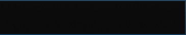

# Texturage de l'interface de gameplay
L'interface de gameplay inclut les éléments de texture généraux qui sont présents dans tous les modes de jeu. Cela inclut des  éléments comme les affichages de nombres, les tableaux de score, les Judgements, et plus encore.

## Curseur ##

### Curseur principal ###

`/Cursor/main-cursor.png`

| Animable | Alignement | Taille suggérée |
|:-:|:-:|:-:|
| Non | MilieuCentre | Aucune |

**Notes:**

- Le curseur de la souris qui est affiché.
- Caché pendant pendant les parties. Actif lors de la navigation dans le menu.

**Valeurs du skin.ini:**

- Aucune

## Notes ##

### Petit grade A ###

`/Grades/grade-small-a.png`

| Animable | Alignement | Taille suggérée |
|:-:|:-:|:-:|
| Non | - | Aucune |

**Notes:**

- L'image qui est affichée à côté de la précision quand elle est entre 90-94%.
- Affiché pendant l'écran des résultats.
- Affiché pendant la sélection des musiques dans l'écran des classements.

**Valeurs du skin.ini:**

- Aucune

---

### Petit grade B ###

`/Grades/grade-small-b.png`

| Animable | Alignement | Taille suggérée |
|:-:|:-:|:-:|
| Non | - | Aucune |

**Notes:**

- L'image qui est affichée à côté de la précision quand elle est entre 80-89%.
- Affiché pendant l'écran des résultats.
- Affiché pendant la sélection des musiques dans l'écran des classements.

**Valeurs du skin.ini:**

- Aucune

---

### Petit grade C ###

`/Grades/grade-small-c.png`

| Animable | Alignement | Taille suggérée |
|:-:|:-:|:-:|
| Non | - | Aucune |

**Notes:**

- L'image qui est affichée à côté de la précision quand elle est entre 70-79%.
- Affiché pendant l'écran des résultats.
- Affiché pendant la sélection des musiques dans l'écran des classements.

**Valeurs du skin.ini:**

- Aucune

---

### Petit grade D ###

`/Grades/grade-small-d.png`

| Animable | Alignement | Taille suggérée |
|:-:|:-:|:-:|
| Non | - | Aucune |

**Notes:**

- L'image qui est affichée à côté de la précision quand elle est en dessous de 70%.
- Affiché pendant l'écran des résultats.
- Affiché pendant la sélection des musiques dans l'écran des classements.

**Valeurs du skin.ini:**

- Aucune

---

### Petit grade F ###

`/Grades/grade-small-f.png`

| Animable | Alignement | Taille suggérée |
|:-:|:-:|:-:|
| Non | - | Aucune |

**Notes:**

- L'image qui est affichée à côté de la précision en cas d'échec sur une map.
- Affiché pendant l'écran des résultats.
- Affiché pendant la sélection des musiques dans l'écran des classements.

**Valeurs du skin.ini:**

- Aucune

---

### Petit grade S ###

`/Grades/grade-small-s.png`

| Animable | Alignement | Taille suggérée |
|:-:|:-:|:-:|
| Non | - | Aucune |

**Notes:**

- L'image qui est affichée à côté de la précision quand elle est entre 95-98%.
- Affiché pendant l'écran des résultats.
- Affiché pendant la sélection des musiques dans l'écran des classements.

**Valeurs du skin.ini:**

- Aucune

---

### Petit grade SS ###

`/Grades/grade-small-ss.png`

| Animable | Alignement | Taille suggérée |
|:-:|:-:|:-:|
| Non | - | Aucune |

**Notes:**

- L'image qui est affichée à côté de la précision quand elle est au dessus de 99%.
- Affiché pendant l'écran des résultats.
- Affiché pendant la sélection des musiques dans l'écran des classements.

**Valeurs du skin.ini:**

- Aucune

---

### Petit grade X ###

`/Grades/grade-small-x.png`

| Animable | Alignement | Taille suggérée |
|:-:|:-:|:-:|
| Non | - | Aucune |

**Notes:**

- L'image qui est Affiché à côté de la précision quand elle est à 100% de précision (Que des marvelous).
- Affiché pendant l'écran des résultats.
- Affiché pendant la sélection des musiques dans l'écran des classements.

**Valeurs du skin.ini:**

- Aucune

---

## Barre de Vie ##

### Fond de la Barre de Vie ###

`/Health/health-background.png`

| Animable | Alignement | Taille suggérée |
|:-:|:-:|:-:|
| Oui | Variable | 600x40 si horizontale. 40x600 si verticale |

**Notes:**

- Nom du fichier d'animation du spritesheet: `/Health/health-background@{rows}x{columns}.png`
- Affiché en tant que fond de la barre de vie. Celle-ci ne change pas et sert seulement de fond à la jauge de vie.

**Valeurs du skin.ini:**

| Nom | Valeurs possibles | Notes |
|:-:|:-:|:-:|
| HealthBarType | `Horizontal` ou `Vertical` | Si votre image est à l'horizontale, inscrivez-y horizontal. Si elle est verticale, inscrivez-y vertical. |
| HealthBarKeysAlignement | `RightStage`, `LeftStage`, ou `HautGauche` | Détermine où placer la barre de vie dans le mode de jeu Keys.

---

### Avant-plan de la Barre de Vie ###

`/Health/health-foreground.png`

| Animable | Alignement | Taille suggérée |
|:-:|:-:|:-:|
| Oui | Variable | 600x40 si horizontale. 40x600 si verticale |

**Notes:**

- Nom du fichier d'animation du spritesheet: `/Health/health-foreground@{rows}x{columns}.png`
- Affiché à l'avant. Cette barre de vie change en fonction de la vie actuelle.

**Valeurs du skin.ini:**

| Nom | Valeurs possibles | Notes |
|:-:|:-:|:-:|
| HealthBarType | `Horizontal` ou `Vertical` | Si votre image est à l'horizontale, inscrivez-y horizontal. Si elle est verticale, inscrivez-y vertical. |
| HealthBarKeysAlignement | `RightStage`, `LeftStage`, or `HautGauche` | Détermine où placer la barre de vie dans le mode de jeu Keys.

## Judgements ##

### Overlay de Judgement ###

`/Judgements/judgement-overlay.png`

| Animable | Alignement | Taille suggérée |
|:-:|:-:|:-:|
| Non | MilieuDroite | 100x100 |

**Notes:**

- Image de fond qui montre les Judgements actuels que le joueur a.
- Coloré automatiquement selon la [valeur de JudgeColors du du skin.ini]()
- Devrait être en blanc!

**Valeurs du skin.ini:**

| Nom | Valeurs possibles | Notes |
|:-:|:-:|:-:|
| JudgeColor{Marv-Miss} | RGB Color (255,255,255) | L'overlay est teinté selon ces valeurs du du skin.ini. 

---

### Judgement (Marv) ###

`/Judgements/judge-marv.png`

| Animable | Alignement | Taille suggérée |
|:-:|:-:|:-:|
| Oui | MilieuCentre | - |

**Notes:**

- Nom de l'animation du spritesheet: `/Judgements/judge-marv@{rows}x{columns}.png`
- Affiché après qu'un judgement est reçu après avoir touché un objet.
- S'il n'y a pas de spritesheet spécifiée, l'animation par défaut sera jouée.

**Valeurs du skin.ini:**

| Nom | Valeurs possibles | Notes |
|:-:|:-:|:-:|
| JudgementHitBurstScale | Float | Cette valeur est multipliée pour aggrandir/réduire la taille du judgement hit burst.
| JudgementBurstPosY | Integer | Détermine la position y de ce sprite.

--- 

### Judgement (Perf) ###

`/Judgements/judge-perf.png`

| Animable | Alignement | Taille suggérée |
|:-:|:-:|:-:|
| Oui | MilieuCentre | - |

**Notes:**

- Nom de l'animation du spritesheet: `/Judgements/judge-perf@{rows}x{columns}.png`
- Affiché après qu'un Judgement est reçu après avoir touché un objet.
- S'il n'y a pas de spritesheet spécifiée, l'animation par défaut sera jouée.

**Valeurs du skin.ini:**

| Nom | Valeurs possibles | Notes |
|:-:|:-:|:-:|
| JudgementHitBurstScale | Float | Cette valeur est multipliée pour aggrandir/réduire la taille du judgement hit burst.
| JudgementBurstPosY | Integer | Détermine la position y de ce sprite.

--- 

### Judgement (Great) ###

`/Judgements/judge-great.png`

| Animable | Alignement | Taille suggérée |
|:-:|:-:|:-:|
| Oui | MilieuCentre | - |

**Notes:**

- Nom de l'animation du spritesheet: `/Judgements/judge-great@{rows}x{columns}.png`
- Affiché après qu'un Judgement est reçu après avoir touché un objet.
- S'il n'y a pas de spritesheet spécifiée, l'animation par défaut sera jouée.

**Valeurs du skin.ini:**

| Nom | Valeurs possibles | Notes |
|:-:|:-:|:-:|
| JudgementHitBurstScale | Float | Cette valeur est multipliée pour aggrandir/réduire la taille du judgement hit burst.
| JudgementBurstPosY | Integer | Détermine la position y de ce sprite.

--- 

### Judgement (Good) ###

`/Judgements/judge-good.png`

| Animable | Alignement | Taille suggérée |
|:-:|:-:|:-:|
| Oui | MilieuCentre | - |

**Notes:**

- Nom de l'animation du spritesheet: `/Judgements/judge-good@{rows}x{columns}.png}`
- Affiché après qu'un Judgement est reçu après avoir touché un objet.
- S'il n'y a pas de spritesheet spécifiée, l'animation par défaut sera jouée.

**Valeurs du skin.ini:**

| Name | Valeurs possibles | Notes |
|:-:|:-:|:-:|
| JudgementHitBurstScale | Float | Cette valeur est multipliée pour aggrandir/réduire la taille du judgement hit burst.
| JudgementBurstPosY | Integer | Détermine la position y de ce sprite.

--- 

### Judgement (Okay) ###

`/Judgements/judge-okay.png`

| Animable | Alignement | Taille suggérée |
|:-:|:-:|:-:|
| Oui | MilieuCentre | - |

**Notes:**

- Nom de l'animation du spritesheet: `/Judgements/judge-okay@{rows}x{columns}.png`
- Affiché après qu'un Judgement est reçu après avoir touché un objet.
- S'il n'y a pas de spritesheet spécifiée, l'animation par défaut sera jouée.

**Valeurs du skin.ini:**

| Nom | Valeurs possibles | Notes |
|:-:|:-:|:-:|
| JudgementHitBurstScale | Float | Cette valeur est multipliée pour aggrandir/réduire la taille du judgement hit burst.
| JudgementBurstPosY | Integer | Détermine la position y de ce sprite.

--- 

### Judgement (Miss) ###

`/Judgements/judge-miss.png`

| Animable | Alignement | Taille suggérée |
|:-:|:-:|:-:|
| Oui | MilieuCentre | - |

**Notes:**

- Nom de l'animation du spritesheet: `/Judgements/judge-miss@{rows}x{columns}.png`
- Displayed when a judgement is received after missing a hitobject.
- S'il n'y a pas de spritesheet spécifiée, l'animation par défaut sera jouée.

**Valeurs du skin.ini:**

| Nom | Valeurs possibles | Notes |
|:-:|:-:|:-:|
| JudgementHitBurstScale | Float | Cette valeur est multipliée pour aggrandir/réduire la taille du judgement hit burst.
| JudgementBurstPosY | Integer | Détermine la position y de ce sprite.

## Nombres ##

### Affichage des nombres du Combo ###

`/Numbers/combo-{0-9}.png`

| Animable | Alignement | Taille suggérée |
|:-:|:-:|:-:|
| Non | MilieuCentre | - |

**Notes:**

- Représente le nombre {0-9} affiché du combo actuel du joueur.

**Valeurs du skin.ini:**

| Name | Valeurs possibles | Notes |
|:-:|:-:|:-:|
| ComboPosY | Integer | Détermine la valeur y pour placer l'affichage du combo. | 
| ComboDisplayScale | Integer | La taille de l'affichage. |

--- 

### Nombres du Score et de la Précision ###

`/Numbers/score-{0-9}.png`

| Animable | Alignement | Taille suggérée |
|:-:|:-:|:-:|
| Non | Varie. HautGauche si score. HautDroite si précision. | - |

**Notes:**

- Représente le nombre {0-9} affiché du score et de la précision actuelle du joueur.

**Valeurs du skin.ini:**

| Nom | Valeurs possibles | Notes |
|:-:|:-:|:-:|
| ScoreDisplayPosX and AccuracyDisplayPosX | Integer | Détermine la position x de l'affichage en fonction de l'Alignement. |
| ScoreDisplayPosY and AccuracyDisplayPosY | Integer | Détermine la position y de l'affichage en fonction de l'Alignement. | 
| ScoreDisplayScale and AccuracyDisplayScale | Integer | La taille de l'affichage. |

--- 

### Affichage du Pourcent du Score ###

`/Numbers/score-percent.png`

| Animable | Alignement | Taille suggérée |
|:-:|:-:|:-:|
| Non | HautDroite | - |

**Notes:**

- Représente le symbole `%` dans la précision du joueur.

**Valeurs du skin.ini:**

| Nom | Valeurs possibles | Notes |
|:-:|:-:|:-:|
| AccuracyDisplayPosX | Integer | Détermine la position x de l'affichage en fonction de l'Alignement. |
| AccuracyDisplayPosY | Integer | Détermine la position y de l'affichage en fonction de l'Alignement. |
| AccuracyDisplayScale | Integer | La taille de l'affichage. | 

---

### Affichage de la Décimale du Score ###

`/Numbers/score-decimal.png`

| Animable | Alignement | Taille suggérée |
|:-:|:-:|:-:|
| Non | HautDroite | - |

**Notes:**

- Représente le symbole `.` dans la précision du joueur

**Valeurs du skin.ini:**

| Nom | Valeurs possibles | Notes |
|:-:|:-:|:-:|
| AccuracyDisplayPosX | Integer | Détermine la position x de l'affichage en fonction de l'Alignement.
| AccuracyDisplayPosY | Integer | Détermine la position y de l'affichage en fonction de l'Alignement.
| AccuracyDisplayScale | Integer | La taille de l'affichage. |

---

### Affichage des Nombres du Temps de la Musique ###

`/Numbers/song-time-{0-9}.png`

| Animable | Alignement | Taille suggérée |
|:-:|:-:|:-:|
| Non | BasGauche / BasDroite | - |

**Notes:**

- Les nombres qui affichent le temps actuel et restant de la musique.

**Valeurs du skin.ini:**

| Nom | Valeurs possibles | Notes |
|:-:|:-:|:-:|
| SongTimeDisplayScale | Integer | La taille de l'affichage. |

---

### Affichage des Deux Points du Temps de la Musique ###

`/Numbers/song-time-colon.png`

| Animable | Alignement | Taille suggérée |
|:-:|:-:|:-:|
| Non | BasGauche / BasDroite | - |

**Notes:**

- Affiche le caractère `:` dans l'affichage du temps de la musique.

**Valeurs du skin.ini:**

| Nom | Valeurs possibles | Notes |
|:-:|:-:|:-:|
| SongTimeDisplayScale | Integer | La taille de l'affichage. |

---

### Affichage du Moins du Temps de la Musique ###

`/Numbers/song-time-minus.png`

| Animable | Alignement | Taille suggérée |
|:-:|:-:|:-:|
| Non | BasGauche / BasDroite | - |

**Notes:**

- Affiche le caractère `-` dans l'affichage du temps de la musique.

**Valeurs du skin.ini:**

| Nom | Valeurs possibles | Notes |
|:-:|:-:|:-:|
| SongTimeDisplayScale | Integer | La taille de l'affichage. |

## Écran de Pause ##

### Bouton Continue de la Pause ###

`/Pause/pause-continue.png`

| Animable | Alignement | Taille suggérée |
|:-:|:-:|:-:|
| Non | MilieuCentre | - |

**Notes:**

- Le bouton pour continuer une map dans l'écran de pause.

**Valeurs du skin.ini:**

* Aucune

--- 

### Bouton Retry de la Pause ###

`/Pause/pause-retry.png`

| Animable | Alignement | Taille suggérée |
|:-:|:-:|:-:|
| Non | MilieuCentre | - |

**Notes:**

- Le bouton pour réessayer une map dans l'écran de pause.

**Valeurs du skin.ini:**

* Aucune

---

### Bouton Back de la Pause ###

`/Pause/pause-back.png`

| Animable | Alignement | Taille suggérée |
|:-:|:-:|:-:|
| Non | MilieuCentre | - |

**Notes:**

- Le bouton pour quitter une map dans l'écran de pause.

**Valeurs du skin.ini:**

* Aucune

---

### Fond de la Pause ###

`/Pause/pause-background.png`

| Animable | Alignement | Taille suggérée |
|:-:|:-:|:-:|
| Non | MilieuCentre | - |

**Notes:**

- L'image Affiché dans le fond dans l'écran de pause. Si rien n'est spécifié, il va être assombri en noir.

**Valeurs du skin.ini:**

* Aucune

## Tableau des Scores ##

### Tableau des Scores Joueur ###

`/Scoreboard/scoreboard.png`

| Animable | Alignement | Taille suggérée |
|:-:|:-:|:-:|
| Non | MilieuGauche | - |

**Notes:**

- L'image de fond Affiché pour le joueur actuel du tableau des scores.

**Valeurs du skin.ini:**

* Aucune

---

### Tableau des Scores Autre ###

`/Scoreboard/scoreboard-other.png`

| Animable | Alignement | Taille suggérée |
|:-:|:-:|:-:|
| Non | MilieuGauche | - |

**Notes:**

- L'image de fond Affiché pour tout les autres joueurs dans le tableau des scores (n'inclut pas le joueur lui-même)

**Valeurs du skin.ini:**

* Aucune

--- 

### Tableau des Scores de l'Équipe Rouge ###

`/Scoreboard/scoreboard-red-team.png`

| Animable | Alignement | Taille suggérée |
|:-:|:-:|:-:|
| Non | MilieuGauche | - |

**Notes:**

- L'image de fond Affiché sur le tableau des scores de l'équipe rouge (n'inclut pas le joueur lui-même)

**Valeurs du skin.ini:**

* Aucune

--- 

### Tableau des scores Équipe Rouge Autre ###

`/Scoreboard/scoreboard-red-team-other.png`

| Animable | Alignement | Taille suggérée |
|:-:|:-:|:-:|
| Non | MilieuGauche | - |

**Notes:**

- L'image de fond Affiché sur le tableau des scores des autres joueurs de l'équipe rouge (n'inclut pas le joueur lui-même)

**Valeurs du skin.ini:**

* Aucune

---

### Tableau des scores Équipe Bleue ###

`/Scoreboard/scoreboard-blue-team.png`

| Animable | Alignement | Taille suggérée |
|:-:|:-:|:-:|
| Non | MilieuGauche | - |

**Notes:**

- L'image de fond Affiché sur le tableau des scores de l'équipe bleue (n'inclut pas le joueur lui-même)

**Valeurs du skin.ini:**

* Aucune

--- 

### Tableau des scores Équipe Bleue Autre ###

`/Scoreboard/scoreboard-blue-team-other.png`

| Animable | Alignement | Taille suggérée |
|:-:|:-:|:-:|
| Non | MilieuGauche | - |

**Notes:**

- L'image de fond Affiché sur le tableau des scores des autres joueurs de l'équipe bleue (n'inclut pas le joueur lui-même)

**Valeurs du skin.ini:**

* Aucune

---

## Affichage du Skip ##

### Skip ###

`/Skip/skip.png`

| Animable | Alignement | Taille suggérée |
|:-:|:-:|:-:|
| Oui | MilieuCentre | 230x56 par frame |

**Notes:**

- Nom du fichier de la spritesheet animable: `/Skip/skip@{rows}x{columns}.png`
- Affiché quand un joueur est sur une pause et est éligible à passer au prochain objet.

**Valeurs du skin.ini:**

- Aucune

## Alertes de Combo ##

### Alerte de Combo ###

`/Combo/combo-alert-1.png`

| Animable | Alignement | Taille suggérée |
|:-:|:-:|:-:|
| Non | MilieuDroite | 300x300 ou plus petit |

**Notes:**

- Affiché tous les 100x de combo.
- Vous pouvez ajouter plusieurs alertes de combo en ajoutant un autre fichier `/Combo/combo-alert-1,2,3.....etc` et elles seront jouées selon l'ordre du nom du fichier.

**Valeurs du skin.ini:**

- Aucune

---

## Battle Royale ##

### Éliminé ###

`/Multiplayer/eliminated.png`

| Animable | Alignement | Taille suggérée |
|:-:|:-:|:-:|
| Non | MilieuCentre | Aucune |

**Notes:**

- Affiché lorsque vous êtes éliminé d'un battle royale.

**Valeurs du skin.ini:**

- BattleRoyaleAlertPosX
- BattleRoyaleAlertPosY
- BattleRoyaleAlertScale

---

### Avertissement ###

`/Multiplayer/warning.png`

| Animable | Alignement | Taille suggérée |
|:-:|:-:|:-:|
| Non | MilieuCentre | Aucune |

**Notes:**

- Affiché lorsque vous êtes dernier dans un battle royale.

**Valeurs du skin.ini:**

- BattleRoyaleAlertPosX
- BattleRoyaleAlertPosY
- BattleRoyaleAlertScale
