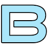
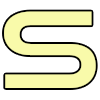
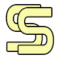
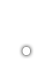
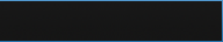
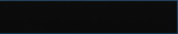

# Skinning dell'Inferfaccia di gioco
L'interfaccia di gioco include elementi presenti in tutte le modalità di gioco. Sono inclusi elementi come numeri, classifiche, giudizi ed altro.

## Cursore ##

### Cursore Principale ###

`/Cursor/main-cursor.png`

| Animazione | Allineamento | Grandezza Suggerita |
|:-:|:-:|:-:|
| No | Centrale | Nessuna |

**Note:**

- Come è visualizzato il cursore del mouse.
- Nascosto durande la partita. Attivo durante la navigazione del menù.

**Valori skin.ini:**

- Nessuno

## Valutazioni ##

### Valutazione A Piccola ###

`/Grades/grade-small-a.png`

| Animazione | Allineamento | Grandezza Suggerita |
|:-:|:-:|:-:|
| No | - | Nessuna |

**Note:**

- L'immagine che è visualizzata accanto alla precisione quando si ha 90-94%.
- Visualizzato nella schermata dei risultati.
- Visualizzato nella schermata di selezione delle canzoni nella classifica.

**Valori skin.ini:**

- Nessuno

---

### Valutazione B Piccola ###

`/Grades/grade-small-b.png`

| Animazione | Allineamento | Grandezza Suggerita |
|:-:|:-:|:-:|
| No | - | Nessuna |

**Note:**

- L'immagine che è visualizzata accanto alla precisione quando si ha 80-89%.
- Visualizzato nella schermata dei risultati.
- Visualizzato nella schermata di selezione delle canzoni nella classifica.

**Valori skin.ini:**

- Nessuno

---

### Valutazione C Piccola ###

`/Grades/grade-small-c.png`

| Animazione | Allineamento | Grandezza Suggerita |
|:-:|:-:|:-:|
| No | - | Nessuna |

**Note:**

- L'immagine che è visualizzata accanto alla precisione quando si ha 70-79%.
- Visualizzato nella schermata dei risultati.
- Visualizzato nella schermata di selezione delle canzoni nella classifica.

**Valori skin.ini:**

- Nessuno

---

### Valutazione D Piccola ###

`/Grades/grade-small-d.png`

| Animazione | Allineamento | Grandezza Suggerita |
|:-:|:-:|:-:|
| No | - | Nessuna |

**Note:**

- L'immagine che è visualizzata accanto alla precisione quando si ha meno di 70%.
- Visualizzato nella schermata dei risultati.
- Visualizzato nella schermata di selezione delle canzoni nella classifica.

**Valori skin.ini:**

- Nessuno

---

### Valutazione F Piccola ###

`/Grades/grade-small-f.png`

| Animazione | Allineamento | Grandezza Suggerita |
|:-:|:-:|:-:|
| No | - | Nessuna |

**Note:**

- L'immagine che è visualizzata accanto alla precisione quando non si passa una mappa.
- Visualizzato nella schermata dei risultati.
- Visualizzato nella schermata di selezione delle canzoni nella classifica.

**Valori skin.ini:**

- Nessuno

---

### Valutazione S Piccola ###

`/Grades/grade-small-s.png`

| Animazione | Allineamento | Grandezza Suggerita |
|:-:|:-:|:-:|
| No | - | Nessuna |

**Note:**

- L'immagine che è visualizzata accanto alla precisione quando si ha 95-98%.
- Visualizzato nella schermata dei risultati.
- Visualizzato nella schermata di selezione delle canzoni nella classifica.

**Valori skin.ini:**

- Nessuno

---

### Valutazione SS Piccola ###

`/Grades/grade-small-ss.png`

| Animazione | Allineamento | Grandezza Suggerita |
|:-:|:-:|:-:|
| No | - | Nessuna |

**Note:**

- L'immagine che è visualizzata accanto alla precisione quando si ha 99%.
- Visualizzato nella schermata dei risultati.
- Visualizzato nella schermata di selezione delle canzoni nella classifica.

**Valori skin.ini:**

- Nessuno

---

### Valutazione X Piccola ###

`/Grades/grade-small-x.png`

| Animazione | Allineamento | Grandezza Suggerita |
|:-:|:-:|:-:|
| No | - | Nessuna |

**Note:**

- L'immagine che è visualizzata accanto alla precisione quando si ha 100% (tutti "Marvelous").
- Visualizzato nella schermata dei risultati.
- Visualizzato nella schermata di selezione delle canzoni nella classifica.

**Valori skin.ini:**

- Nessuno

---

## Barra della Vita##

### Sfondo della Barra della Vita###

`/Health/health-background.png`

| Animazione | Allineamento | Grandezza Suggerita |
|:-:|:-:|:-:|
| Si | Dipende | 600x40 se orizzontale. 40x600 se verticale|

**Note:**

- Nome del file per la disposizione delle immagini per l'animazione: `/Health/health-background@{rows}x{columns}.png`
- Visualizzato come sfondo per la barra della vita. Questa immagine non cambia e serve solo come sfondo per stimare la barra della vita.

**Valori skin.ini:**

| Nome | Valori Possibili | Note |
|:-:|:-:|:-:|
| HealthBarType | `Horizontal` o `Vertical` | Se l'immagine è orrizontale, scrivi "horizontal". Se verticale, scrivi "vertical". |
| HealthBarKeysAlignment| `RightStage`, `LeftStage`, o `TopLeft` | Determina dove viene piazzata la barra della vita nella modalità di gioco Keys.

---

### Primo piano della Barra della Vita###

`/Health/health-foreground.png`

| Animazione | Allineamento | Grandezza Suggerita |
|:-:|:-:|:-:|
| Si | Dipende | 600x40 se orizzontale. 40x600 se verticale |

**Note:**

- Nome del file per la disposizione delle immagini per l'animazione: `/Health/health-foreground@{rows}x{columns}.png`
- Visualizzato come primo piano. Questa è la barra della vita che si muove a seconda della vita corrente.

**Valori skin.ini:**

| Nome | Valori Possibili | Note |
|:-:|:-:|:-:|
| HealthBarType | `Horizontal` o `Vertical` | Se l'immagine è orrizontale, scrivi "horizontal". Se verticale, scrivi "vertical". |
| HealthBarKeysAlignment| `RightStage`, `LeftStage`, o `TopLeft` | Determina dove viene piazzata la barra della vita nella modalità di gioco Keys.

## Giudizi ##

### Sfondo dei Giudizi ###

`/Judgements/judgement-overlay.png`

| Animazione | Allineamento | Grandezza Suggerita |
|:-:|:-:|:-:|
| No | Centrale a Destra | 100x100 |

**Note:**

- Immagine di sfondo che visualizza il giudizio corrente del giocatore.
- Si colora automaticamente in accordo al [valori JudgeColors skin.ini]()
- Dovrebbe essere bianco!

**Valori skin.ini:****

| Nome | Valori Possibili | Note |
|:-:|:-:|:-:|
| JudgeColor{Marv-Miss} | Colori RGB (255,255,255) | Lo sfondo è colorato in accordo a questi valori nello skin.ini. 

---

### Giudizio Marvelous ###

`/Judgements/judge-marv.png`

| Animazione | Allineamento | Grandezza Suggerita |
|:-:|:-:|:-:|
| Si | Centrato | - |

**Note:**

- Nome del file delle immagini per l'animazione:  `/Judgements/judge-marv@{rows}x{columns}.png`
- Visualizzato dopo aver ottenuto un giudizio per aver colpito un oggetto.
- Se nessuna immagine per l'animazione è specificata, sarà eseguita l'animazione standard.

**Valori skin.ini:**

| Nome | Valori Possibili | Note |
|:-:|:-:|:-:|
| JudgementHitBurstScale | Numero Decimale | Questo valore è moltiplicativo ed aumenta/diminuisce la grandezza del giudizio.
| JudgementBurstPosY | Numero Intero | Determina la posizione verticale di questa immagine.

--- 

### Giudizio Perfect ###

`/Judgements/judge-perf.png`

| Animazione | Allineamento | Grandezza Suggerita |
|:-:|:-:|:-:|
| Yes | Centrale | - |

**Note:**

- Nome del file delle immagini per l'animazione:  `/Judgements/judge-perf@{rows}x{columns}.png`
- Visualizzato dopo aver ottenuto un giudizio per aver colpito un oggetto.
- Se nessuna immagine per l'animazione è specificata, sarà eseguita l'animazione standard.

**Valori skin.ini:**

| Nome | Valori Possibili | Note |
|:-:|:-:|:-:|
| JudgementHitBurstScale | Numero Decimale | Questo valore è moltiplicativo ed aumenta/diminuisce la grandezza del giudizio.

| JudgementBurstPosY | Numero Intero | Determina la posizione verticale di questa immagine.

--- 

### Giudizio Great ###

`/Judgements/judge-great.png`

| Animazione | Allineamento | Grandezza Suggerita |
|:-:|:-:|:-:|
| Si | Centrale | - |

**Note:**

- Nome del file delle immagini per l'animazione:  `/Judgements/judge-great@{rows}x{columns}.png`
- Visualizzato dopo aver ottenuto un giudizio per aver colpito un oggetto.
- Se nessuna immagine per l'animazione è specificata, sarà eseguita l'animazione standard.

**Valori skin.ini:**

| Nome | Valori Possibili | Note |
|:-:|:-:|:-:|
| JudgementHitBurstScale | Numero Decimale | Questo valore è moltiplicativo ed aumenta/diminuisce la grandezza del giudizio.
| JudgementBurstPosY | Numero Intero | Determina la posizione verticale di questa immagine.

--- 

### Giudizio Good ###

`/Judgements/judge-good.png`

| Animazione | Allineamento | Grandezza Suggerita |
|:-:|:-:|:-:|
| Si | Centrale | - |

**Note:**

- Nome del file delle immagini per l'animazione:  `/Judgements/judge-good@{rows}x{columns}.png}`
- Visualizzato dopo aver ottenuto un giudizio per aver colpito un oggetto.
- Se nessuna immagine per l'animazione è specificata, sarà eseguita l'animazione standard.

**Valori skin.ini:**

| Nome | Valori Possibili | Note |
|:-:|:-:|:-:|
| JudgementHitBurstScale | Numero Decimale | Questo valore è moltiplicativo ed aumenta/diminuisce la grandezza del giudizio.
| JudgementBurstPosY | Numero Intero | Determina la posizione verticale di questa immagine.

--- 

### Giudizio Okay ###

`/Judgements/judge-okay.png`

| Animazione | Allineamento | Grandezza Suggerita |
|:-:|:-:|:-:|
| Si | Centrale | - |

**Note:**

- Nome del file delle immagini per l'animazione:  `/Judgements/judge-okay@{rows}x{columns}.png`
- Visualizzato dopo aver ottenuto un giudizio per aver colpito un oggetto.
- Se nessuna immagine per l'animazione è specificata, sarà eseguita l'animazione standard.

**Valori skin.ini:**

| Nome | Valori Possibili | Note |
|:-:|:-:|:-:|
| JudgementHitBurstScale | Numero Decimale | Questo valore è moltiplicativo ed aumenta/diminuisce la grandezza del giudizio.
| JudgementBurstPosY | Numero Intero | Determina la posizione verticale di questa immagine.

--- 

### Giudizio Miss ###

`/Judgements/judge-miss.png`

| Animazione | Allineamento | Grandezza Suggerita |
|:-:|:-:|:-:|
| Si | Centrale | - |

**Note:**

- Nome del file delle immagini per l'animazione: `/Judgements/judge-miss@{rows}x{columns}.png`
- Visualizzato dopo aver ottenuto un giudizio per aver colpito un oggetto.
- Se nessuna immagine per l'animazione è specificata, sarà eseguita l'animazione standard.

**Valori skin.ini:**

| Nome | Valori Possibili | Note |
|:-:|:-:|:-:|
| JudgementHitBurstScale | Numero Decimale | Questo valore è moltiplicativo ed aumenta/diminuisce la grandezza del giudizio.
| JudgementBurstPosY | Numero Intero | Determina la posizione verticale di questa immagine.

## Numeri ##

### Numeri della Combo###

`/Numbers/combo-{0-9}.png`

| Animazione | Allineamento | Grandezza Suggerita |
|:-:|:-:|:-:|
| No | Centrale | - |

**Note:**

- I numeri {0-9} che rappresentano la combo corrente del giocatore.

**Valori skin.ini:**

| Nome | Valori Possibili | Note |
|:-:|:-:|:-:|
| ComboPosY | Numero Intero | Determina la posizione verticale di questa immagine.

--- 

### Numeri Punteggio/Precisione ###

`/Numbers/score-{0-9}.png`

| Animazione | Allineamento | Grandezza Suggerita |
|:-:|:-:|:-:|
| No | Dipende. In alto a sinistra per il punteggio. In alto a destra per la precisione. | - |

**Note:**

- I numeri {0-9} che rappresentano il punteggio e la precisione corrente del giocatore.

**Valori skin.ini:**

| Nome | Valori Possibili | Note |
|:-:|:-:|:-:|
| ScoreDisplayPosX ed AccuracyDisplayPosX | Numero Intero | Determina la posizione orizzontale di questa immagine.
| ScoreDisplayPosY and AccuracyDisplayPosX | Numero Intero | Determina la posizione verticale di questa immagine.

--- 

### Immagine del segno Percentuale ###

`/Numbers/score-percent.png`

| Animazione | Allineamento | Grandezza Suggerita |
|:-:|:-:|:-:|
| No | In Alto a Destra | - |

**Note:**

- Rappresenta il simbolo `%` nella precisione dell'utente.

**Valori skin.ini:**

| Nome | Valori Possibili | Note |
|:-:|:-:|:-:|
| AccuracyDisplayPosX | Numero Intero | Determina la posizione orizzontale di questa immagine.
| AccuracyDisplayPosX | Numero Intero | Determina la posizione verticale di questa immagine.

---

### Immagine della Virgola ###

`/Numbers/score-decimal.png`

| Animazione | Allineamento | Grandezza Suggerita |
|:-:|:-:|:-:|
| No | In Alto a Destra | - |

**Note:**

- Rappresenta il simbolo `.` nella precisione dell'utente.

**Valori skin.ini:**

| Nome | Valori Possibili | Note |
|:-:|:-:|:-:|
| AccuracyDisplayPosX | Numero Intero | Determina la posizione orizzontale di questa immagine.
| AccuracyDisplayPosX | Numero Intero | Determina la posizione verticale di questa immagine.

---

### Numberi della Durata della canzone ###

`/Numbers/song-time-{0-9}.png`

| Animazione | Allineamento | Grandezza Suggerita |
|:-:|:-:|:-:|
| No | In Basso a Sinistra / In Basso a Destra | - |

**Note:**

- Numeri della durata rimanente della canzone e momento attuale nella canzone.

**Valori skin.ini:**

* Nessuno

---

### Immagine dei Due Punti###

`/Numbers/song-time-colon.png`

| Animazione | Allineamento | Grandezza Suggerita |
|:-:|:-:|:-:|
| No | In Basso a Sinistra / In Basso a Destra | - |

**Note:**

- Immagine del carattere `:` nella visualizzazione della durata della canzone.

**Valori skin.ini:**

* Nessuno

---

### Immagine del simbolo Meno ###

`/Numbers/song-time-minus.png`

| Animazione | Allineamento | Grandezza Suggerita |
|:-:|:-:|:-:|
| No | In Basso a Sinistra / In Basso a Destra | - |

**Note:**

- Immagine del simbolo `-` nella visualizzazione della durata rimanente della canzone.

**Valori skin.ini:**

* Nessuno

## Schermo della Pausa##

### Tasto Continua ###

`/Pause/pause-continue.png`

| Animazione | Allineamento | Grandezza Suggerita |
|:-:|:-:|:-:|
| No | Centrale | - |

**Note:**

- Il tasto presente nello schermo della pausa per poter continuare la mappa.

**Valori skin.ini:**

* Nessuno

--- 

### Tasto Riprova ###

`/Pause/pause-retry.png`

| Animazione | Allineamento | Grandezza Suggerita |
|:-:|:-:|:-:|
| No | Centrale | - |

**Note:**

- Il tasto presente nello schermo della pausa per poter ricominciare la mappa.

**Valori skin.ini:**

* Nessuno

---

### Tasto Indietro###

`/Pause/pause-back.png`

| Animazione | Allineamento | Grandezza Suggerita |
|:-:|:-:|:-:|
| No | Centrale | - |

**Note:**

- Il tasto presente nello schermo della pausa per poter tornare nel menù di selezione mappa.

**Valori skin.ini:**

* Nessuno

---

### Sfondo della schermata di pausa ###

`/Pause/pause-background.png`

| Animazione | Allineamento | Grandezza Suggerita |
|:-:|:-:|:-:|
| No | Centrale | - |

**Note:**

- Immagine dello sfondo durante la schermata di pausa. Se non specificato sarà oscurato.

**Valori skin.ini:**

* Nessuno

## Classifica ##

### La Tua Classifica###

`/Scoreboard/scoreboard.png`

| Animazione | Allineamento | Grandezza Suggerita |
|:-:|:-:|:-:|
| No | Centrale | - |

**Note:**

- Immagine di sfondo del giocatore corrente sulla classifica.

**Valori skin.ini:**

* Nessuno

---

### Classifica degli Altri###

`/Scoreboard/scoreboard-other.png`

| Animazione | Allineamento | Grandezza Suggerita |
|:-:|:-:|:-:|
| No | Centrale | - |

**Note:**

- Immagine di background per tutti gli altri giocatori nella classifica (non include il giocatore stesso)

**Valori skin.ini:**

* Nessuno

## Visualizzazione Skip##

### Skip ###

`/Skip/skip.png`

| Animazione | Allineamento | Grandezza Suggerita |
|:-:|:-:|:-:|
| Si | Centrato | 230x56 per frame |

**Note:**

- Nome del file di animazione: `/Skip/skip@{rows}x{columns}.png`
- Visualizzato quando il giocatore è ad una pausa ed è possibile saltare al prossimo oggetto.

**Valori skin.ini:**

- Nessuno

## Segnali della Combo ##

### Segnali della Combo ###

`/Combo/combo-alert-1.png`

| Animazione | Allineamento | Grandezza Suggerita |
|:-:|:-:|:-:|
| No | Centrato a Destra | 300x300 o più piccola|

**Note:**

- Visualizzato ogni 100 di combo.
- Puoi aggiungere più segnali della combo aggiungedo altri file `/Combo/combo-alert-1,2,3.....etc` e saranno visualizzati per ordine di nome.

**Valori skin.ini:**

- Nessuno