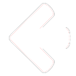
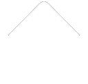

# Texturer le mode Keys (4K et 7K)
Voici la liste des éléments  pour personnaliser le mode de jeu Keys. Cela inclut le 4K et 7K.

**Note: Tous les éléments dans ce cas doivent se trouver dans un dossier intitulé `4K` ou `7K` selon le mode de jeu que vous souhaitez pour l'élément.**

## Colonnes ##

### Column Lighting *(Éclairage de colonne)* ###

`/4k/Column/column-lighting.png`

`/7k/Column/column-lighting.png`

| Animable |  Alignement   | Taille Suggérée |
|:--------:|:-------------:|:---------------:|
|   Non    | Milieu Centré |        -        |

**Notes:**

- Le sprite qui s'affiche et qui éclaire la colonne lors du maintient de la touche correspondante enfoncée.

**Valeurs de skin.ini :**

|         Nom         | Valeurs Possibles  | Note |
|:-------------------:|:------------------:|:----:|
| ColumnLightingScale | Float *(Flottant)* | L'échelle de taille y de l'éclairage de la colonne |

## Lane Cover ##

### Top Lane Cover *(Lane Cover du Haut)* ###

`/4k/LaneCover/cover-top.png`

`/7k/LaneCover/cover-top.png`

| Animable | Alignement | Taille Suggérée |
|:-:|:-:|:-:|
| Non | Bas Gauche | - |

**Notes:**

- Le sprite qui s'affiche se déplace de haut en bas en fonction de la valeur du paramètre correspondant.

---

### Bottom Lane Cover *(Lane Cover du Bas)* ###

`/4k/LaneCover/cover-bottom.png`

`/7k/LaneCover/cover-bottom.png`

| Animable | Alignement | Taille Suggérée |
|:-:|:-:|:-:|
| Non | Haut Gauche | - |

**Notes:**

- Le sprite qui s'affiche se déplace de haut en bas en fonction de la valeur du paramètre correspondant.

## Lighting *(Éclairage)* ##

### Hit Lighting ### 

`/4k/Lighting/hitlighting.png`

`/7k/Lighting/hitlighting.png`

| Animable | Alignement | Taille Suggérée |
|:-:|:-:|:-:|
| Yes | Milieu Centré | - |

**Notes:**

- Noms des sprites pour l'animation en 4K: `/4k/Lighting/hitlighting@{rows}x{columns}.png`
- Noms des sprites pour l'animation en 7K: `/7k/Lighting/hitlighting@{rows}x{columns}.png`
- Lors de la frappe d'une note, une animation sera jouée pour en informer le joueur.
- Si des images d'animation sont données, elles sont lues à 180 FPS.
- Si aucune image d'animation n'est donnée, une animation par défaut est lue.

**Valeurs de skin.ini**

| Nom | Valeurs Possibles | Notes |
|:-:|:-:|:-:|
| HitLightingWidth | Integer *(Entier)* *(Entier)* | La largeur de l'éclairage |
| HitLightingHeight | Integer *(Entier)* *(Entier)* | La largeur de l'éclairage |
| HitLightingY | Integer *(Entier)* *(Entier)*| La position y de l'éclairage |

---

### Hold Lighting ### 

`/4k/Lighting/holdlighting.png`

`/7k/Lighting/holdlighting.png`

| Animable | Alignement | Taille Suggérée |
|:-:|:-:|:-:|
| Oui | Milieu Centré | - |

**Notes:**

- Noms des sprites pour l'animation en 4K: `/4k/Lighting/holdlighting@{rows}x{columns}.png`
- Noms des sprites pour l'animation en 7K: `/7k/Lighting/holdlighting@{rows}x{columns}.png`
- Lors du maintient d'une longue note, une animation sera jouée pour en informer le joueur.
- Si des images d'animation sont données, elles sont lues à 180 FPS.
- Si aucune image d'animation n'est donnée, une animation par défaut est lue.

**Valeurs de skin.ini**

| Nom | Valeurs Possibles | Notes |
|:-:|:-:|:-:|
| HitLightingWidth | Integer *(Entier)* | La largeur de l'éclairage |
| HitLightingHeight | Integer *(Entier)* | La largeur de l'éclairage |
| HitLightingY | Integer *(Entier)* | La position y de l'éclairage |

## Notes ##

### HitObjects *(Objets de Frappes)* ###

`/4k/HitObjects/note-hitobject-{1-4}.png`

`/7k/HitObjects/note-hitobject-{1-7}.png`

| Animable | Alignement | Taille Suggérée |
|:-:|:-:|:-:|
| Non | Haut Gauche | - |

**Notes:**

- La note qui tombe à l'écran pour les objets autres que ceux maintenus.
- Nom de fichiers si `ColorObjectsBySnapDistance` est défini sur `true` dans skin.ini: `/4k/HitObjects/note-hitobject-{1-4}-{2nd, 3rd, 4th, 6th, 8th, 12th, 16th, 48th}.png`

**Valeurs de skin.ini**

| Nom | Valeurs Possibles | Notes |
|:-:|:-:|:-:|
| FlipNoteImagesOnUpscroll | Boolean (True ou False) | Si l'image sera retournée pour un défilement vers le haut. |
| ColorObjectsBySnapDistance | Boolean (True ou False) | Si spécifié, il recherchera les noms de fichiers avec la distance de snap spécifiée. S'il ne le trouve pas, ceux par défaut seront utilisés.

### HoldHitObjects *(Objets de Frappes Maintenus)* ###

`/4k/HoldHitObjects/note-holdhitobject-{1-4}.png`

`/7k/HoldHitObjects/note-holdhitobject-{1-7}.png`

| Animable | Alignement | Taille Suggérée |
|:-:|:-:|:-:|
| Non | Haut Gauche | - |

**Notes:**

- La note qui tombe à l'écran pour les notes maintenues (longues notes).
- Nom de fichiers si `ColorObjectsBySnapDistance` est défini sur `true` dans skin.ini: `/4k/HitObjects/note-hitobject-{1-4}-{2nd, 3rd, 4th, 6th, 8th, 12th, 16th, 48th}.png`

**Valeurs de skin.ini**

| Nom | Valeurs Possibles | Notes |
|:-:|:-:|:-:|
| FlipNoteImagesOnUpscroll | Boolean (True ou False) | Si l'image sera retournée pour un défilement vers le haut. |Si spécifié, il recherchera les noms de fichiers avec la distance de snap spécifiée. S'il ne le trouve pas, ceux par défaut seront utilisés.

### HoldBodies *(Corps de Notes Maintenues)* ###

`/4k/HoldBodies/note-holdbody-{1-4}.png`

`/7k/HoldEnds/note-holdbody-{1-7}.png`

| Animable | Alignement | Taille Suggérée |
|:-:|:-:|:-:|
| Oui | Haut Gauche | - |

**Notes:**

- Nom du fichier d'animation pour le 4K : `/4k/HoldBodies/note-holdbody-{1-4}@{rows}x{columns}.png`
- Nom du fichier d'animation pour le 7K : `/7k/HoldEnds/note-holdbody-{1-7}@{rows}x{columns}.png`
- Le corps d'une note maintenue (longue).
- Si l'animation est spécifiée, les images seront jouées à 30 FPS.

**Valeurs de skin.ini**

| Nom | Valeurs Possibles | Notes |
|:-:|:-:|:-:|
| FlipNoteImagesOnUpscroll | Boolean (True ou False) | Si l'image sera retournée pour un défilement vers le haut. |

### HoldEnds *(Fin de Notes Maintenues)* ###

`/4k/HoldEnds/note-holdend-{1-4}.png`

`/7k/HoldEnds/note-holdend-{1-7}.png`

| Animable | Alignement | Taille Suggérée |
|:-:|:-:|:-:|
| Non | Haut Gauche | - |

**Notes:**

- L'image affichée à la fin d'une note maintenue (longue).

**Valeurs de skin.ini**

| Nom | Valeurs Possibles | Notes |
|:-:|:-:|:-:|
| FlipNoteImagesOnUpscroll | Boolean (True ou False) | Si l'image sera retournée pour un défilement vers le haut. |

## Receptors *(Récepteurs)* ##

### Receptors (Up) *(Récepteurs Relachés)* ### 

`/4k/Receptors/receptor-up-{1-4}.png`

`/7k/Receptors/receptor-up-{1-7}.png`

| Animable | Alignement | Taille Suggérée |
|:-:|:-:|:-:|
| Non | Haut Gauche | Image Carrée (256x256) |

**Notes:**

- L'image affichée lorsque la touche n'est pas appuyée.

**Valeurs de skin.ini**

| Nom | Valeurs Possibles | Notes |
|:-:|:-:|:-:|
| ReceptorPosOffsetY | Integer *(Entier)* | Le décalage de position y des Récepteurs par rapport au bas/haut du niveau |
| ColumnSize | Integer *(Entier)* | Réduit la largeur des Récepteurs
| ReceptorsOverHitObjects | True ou False | Si `true`, les Récepteurs seront par dessus les notes lorsqu'elles passeront

---

### Receptors (Down) *(Récepteurs Pressés)* ### 

`/4k/Receptors/receptor-down-{1-4}.png`

`/7k/Receptors/receptor-down-{1-7}.png`

| Animable | Alignement | Taille Suggérée |
|:-:|:-:|:-:|
| Non | Haut Gauche | Image Carrée (256x256) |

**Notes:**

- L'image affichée lorsque la touche est pressée.

**Valeurs de skin.ini**

| Nom | Valeurs Possibles | Notes |
|:-:|:-:|:-:|
| ReceptorPosOffsetY | Integer *(Entier)* | Le décalage de position y des Récepteurs par rapport au bas/haut du niveau |
| ColumnSize | Integer *(Entier)* | Réduit la largeur des Récepteurs |
| ReceptorsOverHitObjects | True or False | Si `true`, les Récepteurs seront par dessus les notes lorsqu'elles passeront |
 
## Stage *(Niveau)* ##

### Stage BG Mask *(Masque d'Arrière Plan du Niveau)* ### 

`/4k/Stage/stage-bgmask.png`

`/7k/Stage/stage-bgmask.png`

| Animable | Alignement | Taille Suggérée |
|:-:|:-:|:-:|
| Non | Milieu Centré | - |

**Notes:**

- L'arrière plan du niveau. Les notes tombent devant cette zone.

**Valeurs de skin.ini**

| Nom | Valeurs Possibles | Notes |
|:-:|:-:|:-:|
| BgMaskAlpha | Float (0.0-1.0) | L'opacité du masque d'arrière plan.

---

### Stage Distant Overlay ### 

`/4k/Stage/stage-distant-overlay.png`

`/7k/Stage/stage-distant-overlay.png`

| Animable | Alignement | Taille Suggérée |
|:-:|:-:|:-:|
| Non | Centre Haut | - |

**Notes:**

- Affiché au centre haut du niveau. Utilisé couramment pour couvrir les notes en haut de l'écran.

**Valeurs de skin.ini**

- Aucune.

---

### Stage Hit Position Overlay *(Overlay de Position de Frappe du Niveau)* ###

`/4k/Stage/stage-hitposition-overlay.png`

`/7k/Stage/stage-hitposition-overlay.png`

| Animable | Alignement | Taille Suggérée |
|:-:|:-:|:-:|
| Non | Milieu Centré | - |

**Notes:**

- Une image qui se trouve directement au dessus de la position de frappe, utilisée pour indiquer où le joueur doit frapper.

**Valeurs de skin.ini**

- Aucune.

---

### Stage Left Border *(Bordure Gauche du Niveau)* ###

`/4k/Stage/stage-left-border.png`

`/7k/Stage/stage-left-border.png`

| Animable | Alignement | Taille Suggérée |
|:-:|:-:|:-:|
| Non | Haut Gauche | - |

**Notes:**

- Affiché en haut à gauche du niveau. Utilisation purement esthétique.

**Valeurs de skin.ini**

- Aucune.

---

### Stage Right Border *(Bordure Droite du Niveau)* ###

`/4k/Stage/stage-right-border.png`

`/7k/Stage/stage-right-border.png`

| Animable | Alignement | Taille Suggérée |
|:-:|:-:|:-:|
| Non | Haut Droit | - |

**Notes:**

- Affiché en haut à droite du niveau. Utilisation purement esthétique.

**Valeurs de skin.ini**

- Aucune.

---

## Editor *(Editeur)* ##

### Layer HitObjects *(Calque de Notes)*

`/4k/Editor/note-hitobject-{1-4}.png`

`/7k/Editor/note-hitobject-{1-7}.png`

| Animable | Alignement | Taille Suggérée |
|:-:|:-:|:-:|
| Non | Haut Gauche | - |

**Notes:**

- Les notes affichées lors de l'activation de l'option "View Layers" dans l'éditeur.

**Valeurs de skin.ini**

- Aucune.

---

### Layer Note Holdbodies *(Calque de Corps de Notes Maintenues)*

`/4k/Editor/note-holdbody-{1-4}.png`

`/7k/Editor/note-holdbody-{1-7}.png`

| Animable | Alignement | Taille Suggérée |
|:-:|:-:|:-:|
| Non | Haut Gauche | - |

**Notes:**

- Les corps des notes maintenues affichées lors de l'activation "View Layers" dans l'éditeur.

**Valeurs de skin.ini**

- Aucune.

---

### Layer Note Holdends *(Calque de Fin de Notes Maintenues)*

`/4k/Editor/note-holdend-{1-4}.png`

`/7k/Editor/note-holdend-{1-7}.png`

| Animable | Alignement | Taille Suggérée |
|:-:|:-:|:-:|
| Non | Haut Gauche | - |

**Notes:**

- La fin des notes maintenues affichées lors de l'activation "View Layers" dans l'éditeur.

**Valeurs de skin.ini**

- Aucune.